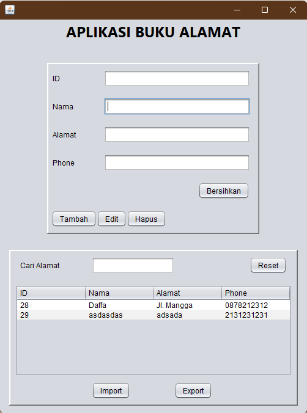

# AplikasiBukuAlamat-UTS
 UTS - Muhammad Daffa Saputra - 2210010440

Aplikasi Buku Alamat adalah aplikasi berbasis Java Swing untuk mengelola data buku alamat. Aplikasi ini mendukung operasi seperti menambahkan, memperbarui, menghapus, mencari, mengekspor, dan mengimpor data.

## Fitur
- **Tambah Data**: Menambahkan entri baru ke buku alamat.
- **Perbarui Data**: Memperbarui data yang sudah ada berdasarkan ID.
- **Hapus Data**: Menghapus entri berdasarkan ID.
- **Cari Data**: Mencari data menggunakan kata kunci (nama, alamat, atau nomor telepon).
- **Ekspor Data**: Mengekspor data buku alamat ke file teks.
- **Impor Data**: Mengimpor data dari file teks ke buku alamat.
- **Reset Pencarian**: Memuat ulang semua data.

## Prasyarat
- Java Development Kit (JDK) versi 8 atau lebih baru.
- Database SQLite.

## Struktur File
- `src`: Folder berisi file kode sumber aplikasi.
- `DatabaseConnection.java`: Kelas untuk menghubungkan aplikasi ke database SQLite.
- `addressbook.txt`: File untuk ekspor dan impor data.

## Cara Menjalankan
1. **Clone repository**:
   ```bash
   git clone https://github.com/username/address-book-app.git
   cd address-book-app
2. **Siapkan Database**:
   Buat file database SQLite bernama `addressbook.db` di direktori proyek, lalu buat tabel menggunakan skrip berikut:
   ```sql
   CREATE TABLE AddressBook (
       id INTEGER PRIMARY KEY AUTOINCREMENT,
       name TEXT NOT NULL,
       address TEXT NOT NULL,
       phone TEXT NOT NULL
   );
3. **Import Proyek ke IDE**:
   - Buka IDE seperti NetBeans, IntelliJ IDEA, atau Eclipse.
   - Pilih opsi untuk *Import Project* atau *Open Project*.
   - Arahkan ke folder proyek yang telah di-clone (`address-book-app`).
   - Pastikan library JDBC untuk SQLite sudah di-*add* ke proyek.
4. **Jalankan Aplikasi**:
   - Kompilasi aplikasi dengan IDE.
   - Klik tombol "Run" untuk menjalankan aplikasi.
   - Antarmuka pengguna akan terbuka untuk mengelola data buku alamat.
5. **Fungsi Tambahan**:
   - Ekspor data ke file teks dengan tombol *Export*.
   - Impor data dari file teks menggunakan tombol *Import*.
   - Gunakan *Search* untuk mencari entri spesifik berdasarkan nama, alamat, atau nomor telepon.
## Screenshot
Tangkapan layar aplikasi:


## Lisensi
Proyek ini menggunakan lisensi MIT. Silakan baca file `LICENSE` untuk informasi lebih lanjut.
